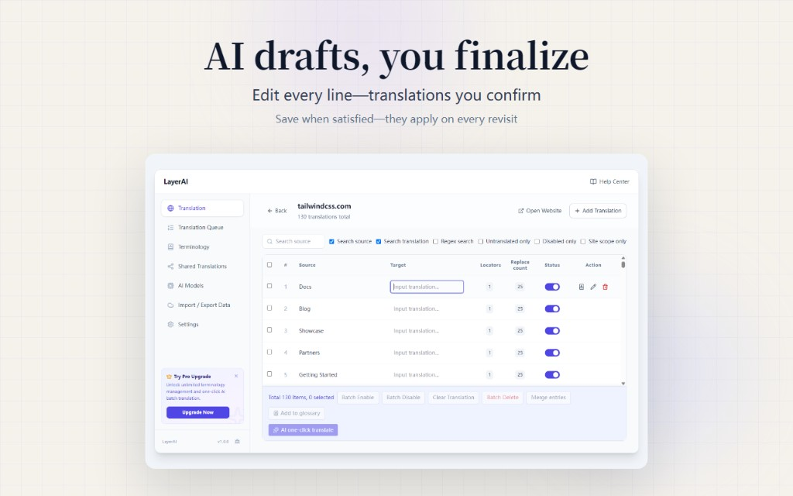

  

# LayerAI

**Local-first AI translation workflow for the web**

[🇨🇳 中文](./README_ZH.md) · [🌐 Website](https://layerai.yun/) · [📖 Docs](https://docs.layerai.yun) · [🧩 Chrome Extension](https://chromewebstore.google.com/detail/enpnogogneglhpcdkfppcjnbbjafhikc)

---

  

LayerAI is a browser extension that helps you collect page text, run AI translation, govern terminology, and apply multilingual replacements on the web.

Unlike tools that re-translate on every page load, LayerAI turns confirmed translations into reusable assets. When the same page content has not changed, saved wording applies automatically.

---

## Capabilities

| Capability | Description |
|------------|-------------|
| **Collect** | Extract text from the current page, whole site, or a selected range |
| **Translate** | Multiple AI models with glossary constraints; queued execution with retries |
| **Replace** | Automatically apply saved translations on the original page |
| **Govern** | Glossaries and shared translation submit/review for consistent wording |
| **Sync** | Local import/export; Pro / Max users get cloud sync and Google Drive backup |

The Free plan is enough to validate the full flow. Pro / Max add higher quotas, collaboration, and sync.

---

## Quick start

1. Install the [Chrome extension](https://chromewebstore.google.com/detail/enpnogogneglhpcdkfppcjnbbjafhikc)
2. Open any foreign-language page and complete: collect → translate → save
3. Refresh — saved translations apply automatically

Full guides: [Introduction](https://docs.layerai.yun/introduction) · [Your first translation](https://docs.layerai.yun/journey/first-translation)

---

## Links

- Website & billing: https://layerai.yun/
- Documentation: https://docs.layerai.yun
- Docs source: [layerai-docs](https://github.com/houguang/layerai-docs)

---

## Feedback & questions

Please use **[Issues](https://github.com/houguang/layerai/issues)** for questions, bug reports, and feature requests.

When filing an issue, include if possible:

- Browser and extension version
- Steps to reproduce or expected behavior
- Screenshots or error messages

---

## Vision

Upgrade fragmented foreign-language web reading into a collaborative, durable translation workflow.

**Translate once. Reuse forever.**
